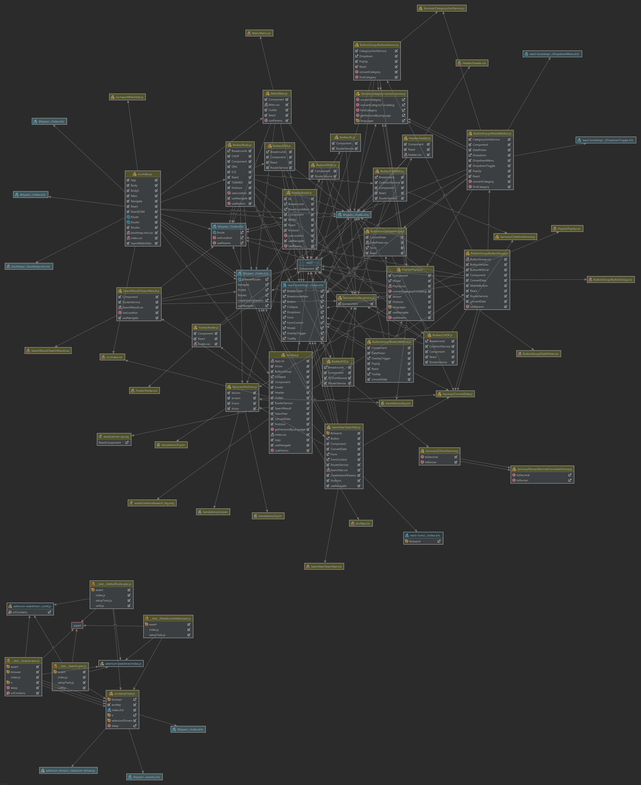

# README MEDCODESEARCH

### Brief description

This React-App is used to represent the different catalogs which gets updated every year or two. This website helps to 
find the catalog number easier and to look up the different versions or expiry dates. \
Frontend from the website: [medcodesearch.ch](http://medcodesearch.ch) \
Backend which is used is: [search.eonum.ch](https://search.eonum.ch/documentation) 

### Installation instructions

For the local installation go into the folder `medcodesearch-frontend-react` and run `npm install`. To start the local app run `npm start`. 
It will open at [http://localhost:3000](http://localhost:3000) in your browser.

### Issues

There is one screen size in which the buttons don't line up perfectly, but we couldn't figure out which exactly.

### Coding conventions

Each class is defined in *its own file*. \
Everything has been written in English (Comments included). \
The first letter of a classname is in uppercase, the reminder is lowercase. \
Method-names are always lowercase. \
Variable-names are lowercase if only "oneword"-word, otherwise the first letter in between is capital. \
Constants are always uppercase. \
All components reside in their own subdirectory in `/src/Components`. \
All services reside in their own subdirectory in `/src/Services`. \
All test-suites reside in their own subdirectory in `/src/__test_`. \
Every method has its own documentation written in Javadoc. 

### Testing
We use jest and puppeteer for our tests. Since we use typescript, we also need babel for transformation.
#### Prerequisites
If not already installed from  `npm install` execute  
`npm install --save-dev jest puppeteer jest-puppeteer`  
`npm install --save-dev @testing-library/react` 
`npm install --save-dev start-server-and-test` 
`npm install --save-dev @babel/preset-typescript` 
#### Config
All the configuration for jest, puppeteer and babel are specified in the  files jest.config.js, jest-puppeteer.config.js 
and babel.config.js in the root folder and can be adapted to your needs. Since we do UI tests, we need a running server.
This is implemented via jest-puppeteer config file server block `server: { command: "npm run startHeadlessTestPort"}` and 
corresponding scripts in package.json
`"test": "jest --runInBand"` and `"startHeadlessOnTestPort": "BROWSER=none PORT=$npm_package_config_testPort npm start"`.
#### Run tests
Use `npm test` to start headless server and tests. You can also just test single suites using 
`npm test /path/to/test/file`. Currently the port is set to `localhost:8080` in package.json.

### Contact
For further question: 
- +41 (0)31 311 17 06 -> eonum contact
- [info@eonum.ch](info@eonum.ch) -> eonum contact
- [jan.koch@students.unibe.ch](jan.koch@students.unibe.ch) -> university development team
- [eonum.ch/de/kontakt/](https://eonum.ch/de/kontakt/) -> eonum website

### Diagram

